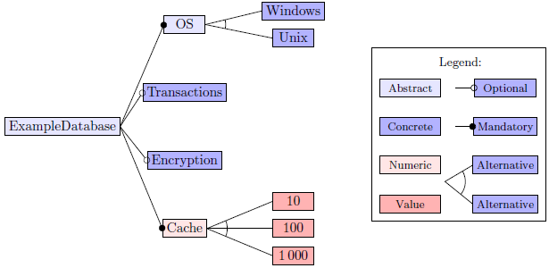

# TikZ Feature Model

LaTeX command to visualize a [feature model](https://en.wikipedia.org/wiki/Feature_model) with TikZ.



## Usage

Import TikZ and the required TikZ libraries:
```tex
\usepackage{tikz}

\usetikzlibrary{arrows}
\usetikzlibrary{positioning}
\usetikzlibrary{calc}
```

Import the file `tikz-feature-model.tex`, which defines the command `\tikzfeaturemodel`.

Example:

```tex
\tikzfeaturemodel{9,1}{
    \node [abstract] {ExampleDatabase}
        child [mandatory] { node [abstract] (os) {OS}
            child { node (windows) {Windows} }
            child { node (unix) {Unix} }
        }
        child [optional] { node {Transactions} }
    ;

    \alternative{os}{windows}{unix}
}
```

Complete examples are available in the `examples` directory.

## Documentation

The `\tikzfeaturemodel` takes one optional and two required arguments:
* The optional argument can be used to add or modify TikZ styles.
* The first required argument is the position for the legend as `X,Y`.
  The origin for coordinates is the root node of the feature tree.
  The specifies coordinates define the position of the first node in the legend, i.e. 'Abstract'.
* The second required argument is the content for the diagram.
  The content consits of a tree and optionally additional commands.

The following named styles can be applied to children in the feature tree:
* `mandatory`: Marks the incoming edge as mandatory.
* `optional`: Marks the incoming edge as optional.

The following names styles can be applied to nodes in the feature tree:
* `multiline`: Allows using multiline text in the node.
* `abstract`: Marks the feature as abstract.
* `numeric`: Marks the feature as numeric.
* `value`: Marks the feature as value of a numeric feature.

The following additional commands can be used after the tree:
* `\alternative`: Use this command to mark an alternative group.
  The command takes three required arguments: the root node of the alternative group and the first and last child.
* `\constraints`: Use this command to specify cross-tree constraints.
  The command takes two required arguments: a position and the text content.
